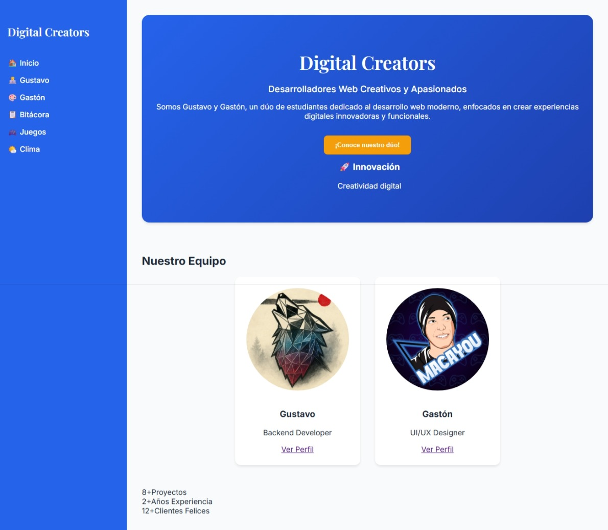

# Digital Creators - Trabajo Práctico Grupal 3

Evolución del proyecto SPA con 5 mejoras implementadas: animaciones, filtros avanzados, barras de progreso, redes sociales y carrusel de proyectos.

## Integrantes

- **Gustavo** - Backend Developer | Corrientes, Argentina | 31 años
- **Gastón** - UI/UX Designer | Corrientes, Argentina | 29 años

## Tecnologías

- **React 18** - Librería de UI con componentes
- **React Router DOM 6** - Enrutamiento SPA
- **Vite** - Build tool moderno
- **CSS3** - Estilos con variables CSS y animaciones
- **JavaScript ES6+** - Lógica de aplicación
- **JSON** - Datos locales (25 videojuegos)
- **OpenWeatherMap API** - Datos de clima
- **Unsplash API** - Imágenes para proyectos

---

## 🆕 Mejoras Implementadas - TP3

### Mejora 1: ✨ Animaciones Suaves

Implementación de transiciones y efectos visuales en toda la aplicación para mejorar la experiencia de usuario.

**Características:**
- Animación de fade-in al cargar páginas
- Efectos hover en tarjetas y botones con elevación
- Transiciones suaves entre rutas
- Animación de entrada escalonada para elementos
- Efecto de brillo en botones (ripple effect)
- Pulse animation en elementos destacados

**Capturas:**

**Antes:**

*Elementos estáticos sin transiciones*

**Después:**

*Animaciones suaves con hover effects y transiciones*

---

### Mejora 2: 🔍 Búsqueda/Filtrado en JSON Local

Sistema de filtrado avanzado para la galería de videojuegos con múltiples opciones de búsqueda.

**Características:**
- Botones de filtro por género (dinámicos según JSON)
- Búsqueda por texto en título, género y descripción
- Combinación de filtros + búsqueda simultánea
- Contador de resultados en tiempo real
- Botón "Limpiar Filtros" contextual
- 13 géneros únicos disponibles

**Géneros disponibles:**
Adventure, Platformer, RPG, Action-Adventure, First-Person Shooter, Action RPG, Fighting, Puzzle, Sandbox, Battle Royale, Arcade, Puzzle-Platform

**Capturas:**

**Antes:**

*Solo búsqueda básica por texto*

**Después:**

*Filtros por género con botones interactivos + contador de resultados*

---

### Mejora 3: 📊 Barras de Progreso de Habilidades

Visualización profesional de habilidades mediante barras de progreso animadas en los perfiles.

**Características:**
- Barras animadas con porcentaje de dominio
- Animación de llenado progresivo al cargar
- Colores según nivel de habilidad:
  - 🟢 Verde (90-100%): Experto
  - 🔵 Azul (85-89%): Avanzado
  - 🟠 Naranja (78-84%): Intermedio
- Efecto de brillo en las barras
- Hover effects con elevación
- Badge de porcentaje con color accent
- Diseño coherente con paleta del sitio

**Perfiles actualizados:**
- **Gustavo:** 6 habilidades backend (Node.js 95%, Python 88%, MongoDB 90%, PostgreSQL 85%, Docker 82%, AWS 78%)
- **Gastón:** 6 habilidades de diseño (Figma 98%, Adobe CS 92%, User Research 85%, Design Systems 88%, Sketch 80%, Principios UX 90%)

**Capturas:**

**Antes:**

*Lista simple de habilidades sin porcentajes*

**Después:**

*Barras de progreso animadas con porcentajes y colores según nivel*

---

### Mejora 4: 🔗 Botones de Redes Sociales Animados

Iconos de redes sociales interactivos en los perfiles de cada integrante.

**Características:**
- 3 botones por perfil: GitHub, LinkedIn, Email
- Colores corporativos de cada red social
- Animaciones al hover:
  - Rotación del icono (360°)
  - Elevación del botón
  - Efecto de brillo interno
  - Cambio de color
- Efecto de onda al hacer clic
- Iconos SVG escalables
- 100% responsive (apilados en móvil)

**Enlaces (placeholder):**
- GitHub: github.com/usuario
- LinkedIn: linkedin.com/in/usuario
- Email: usuario@digitalcreators.com

**Capturas:**

**Antes:**

*Sin enlaces a redes sociales*

**Después:**

*Botones animados con iconos de GitHub, LinkedIn y Email*

---

### Mejora 5: 🎠 Carrusel de Proyectos Destacados

Página completa dedicada a mostrar proyectos del equipo con carrusel interactivo.

**Características:**
- Carrusel con 5 proyectos ficticios profesionales
- Navegación con flechas laterales (← →)
- Indicadores (dots) con tooltips
- Contador visual (1/5, 2/5, etc.)
- Tarjetas grandes con:
  - Imagen de alta calidad (Unsplash)
  - Título y año del proyecto
  - Badge de categoría (Full Stack, AI/ML, IoT, Mobile)
  - Descripción detallada
  - Tags de tecnologías
  - Botón "Ver Proyecto Completo"
- Grid de miniaturas debajo del carrusel
- Click en miniatura para navegar rápido
- Transiciones suaves entre slides
- Zoom en imágenes al hover

**Proyectos incluidos:**
1. E-Commerce Platform (React, Node.js, MongoDB, Stripe) - 2024
2. Task Management App (React, Firebase, Material UI, PWA) - 2024
3. AI Image Generator (Python, TensorFlow, FastAPI, React) - 2024
4. Fitness Tracker Mobile (React Native, GraphQL, PostgreSQL, AWS) - 2023
5. Smart Home Dashboard (Vue.js, MQTT, InfluxDB, Docker) - 2023

**Capturas:**

**Antes:**

*No existía sección de proyectos*

**Después:**

*Página completa con carrusel interactivo y grid de miniaturas*

---

## Estructura del Proyecto

```
digital-creators-tp3/
├── public/
│   ├── img/
│   │   ├── avatar2.jpg
│   │   ├── avatar3.jpg
│   │   ├── mejora1-antes.png
│   │   ├── mejora1-despues.png
│   │   ├── mejora2-antes.png
│   │   ├── mejora2-despues.png
│   │   ├── mejora3-antes.png
│   │   ├── mejora3-despues.png
│   │   ├── mejora4-antes.png
│   │   ├── mejora4-despues.png
│   │   ├── mejora5-antes.png
│   │   └── mejora5-despues.png
│   ├── diagrama-componentes.png
│   ├── diagrama-carpetas.png
│   └── vite.svg
├── src/
│   ├── components/
│   │   ├── Layout/
│   │   │   ├── Sidebar.jsx
│   │   │   └── Header.jsx
│   │   ├── Pages/
│   │   │   ├── Home.jsx
│   │   │   ├── ProfileGustavo.jsx (con barras + redes)
│   │   │   ├── ProfileGaston.jsx (con barras + redes)
│   │   │   ├── GamesGallery.jsx (con filtros)
│   │   │   ├── WeatherSection.jsx
│   │   │   ├── ProjectsCarousel.jsx (NUEVO)
│   │   │   ├── Bitacora.jsx
│   │   │   └── NotFound.jsx
│   │   └── Sections/
│   │       ├── HeroSection.jsx
│   │       ├── TeamSection.jsx
│   │       └── StatsSection.jsx
│   ├── data/
│   │   └── games.json
│   ├── styles/
│   │   └── index.css (con mejoras 1-5)
│   ├── App.jsx (ruta /proyectos agregada)
│   ├── main.jsx
│   └── index.css
├── vite.config.js
├── package.json
├── .gitignore
└── README.md
```

## Rutas Disponibles

| Ruta | Componente | Descripción | Nuevo en TP3 |
|------|-----------|-------------|--------------|
| `/` | Home | Página principal | - |
| `/gustavo` | ProfileGustavo | Perfil de Gustavo | ✅ Barras + Redes |
| `/gaston` | ProfileGaston | Perfil de Gastón | ✅ Barras + Redes |
| `/games` | GamesGallery | Galería de videojuegos | ✅ Filtros |
| `/proyectos` | ProjectsCarousel | Carrusel de proyectos | ✅ NUEVO |
| `/clima` | WeatherSection | Consulta de clima | - |
| `/bitacora` | Bitacora | Bitácora del proyecto | - |
| `*` | NotFound | Página 404 | - |

## Instalación Local

### Requisitos
- Node.js v16+
- npm o yarn

### Pasos

1. Clonar repositorio
```bash
git clone https://github.com/usuario/digital-creators-tp3.git
cd digital-creators-tp3
```

2. Instalar dependencias
```bash
npm install
```

3. Ejecutar en desarrollo
```bash
npm run dev
```

4. Abrir en navegador
```
http://localhost:5173/
```

## Build para Producción

```bash
npm run build
```

Genera carpeta `dist/` optimizada.

## Deploy en Vercel

1. Sube código a GitHub
```bash
git add .
git commit -m "TP3 completado - 5 mejoras implementadas"
git push origin main
```

2. Ve a https://vercel.com
3. Importa repositorio desde GitHub
4. Vercel detecta automáticamente que es Vite
5. Haz clic en "Deploy"

Tu sitio estará en: `https://digital-creators-tp3.vercel.app`

## Paleta de Colores

- Primario: `#2563eb` (Azul)
- Secundario: `#1e40af` (Azul oscuro)
- Acento: `#f59e0b` (Amarillo/Naranja)
- Éxito: `#10b981` (Verde)
- Fondo: `#ffffff` (Blanco)
- Superficie: `#f8fafc` (Gris claro)

## Tipografía

- **Títulos**: Playfair Display (serif)
- **Cuerpo**: Inter (sans-serif)

## Responsividad

Breakpoints implementados:
- ≤ 480px: Móviles pequeños
- 481px - 768px: Móviles grandes y tablets pequeñas
- 769px - 1024px: Tablets
- ≥ 1025px: Desktop

## Decisiones de Desarrollo - TP3

### Mejora 1: Animaciones
Uso de keyframes CSS y transitions para crear experiencia fluida sin librerías externas. Animaciones respetan `prefers-reduced-motion` para accesibilidad.

### Mejora 2: Sistema de Filtros
Implementación con useState y useEffect para filtrado reactivo. Extracción dinámica de géneros desde JSON usando Set para evitar duplicados.

### Mejora 3: Barras de Progreso
Sistema de visualización profesional con gradientes según nivel. Animación CSS con `animation-delay` para efecto escalonado.

### Mejora 4: Redes Sociales
Botones con iconos SVG inline para máxima personalización. Efectos hover complejos usando ::before y ::after pseudoelementos.

### Mejora 5: Carrusel
Componente controlado con useState para navegación. Imágenes de Unsplash para calidad profesional. Grid de miniaturas para navegación rápida.

## Requisitos Cumplidos - TP3

### Obligatorios
- ✅ 5 mejoras implementadas del listado sugerido
- ✅ Diseño responsive en todas las mejoras
- ✅ Coherencia con paleta de colores del sitio
- ✅ Documentación en README.md con capturas Antes/Después
- ✅ Publicación en Vercel
- ✅ Repositorio separado del TP1 y TP2

### Mejoras Seleccionadas
1. ✅ Animaciones suaves (CSS puro)
2. ✅ Búsqueda/Filtrado en JSON local
3. ✅ Barras de progreso de habilidades
4. ✅ Botones de redes sociales animados
5. ✅ Carrusel de proyectos destacados

## Dificultades Encontradas - TP3

### Sistema de Filtros
**Problema:** Combinar búsqueda de texto con filtros de género sin conflictos.
**Solución:** Uso de useEffect con dependencias múltiples para aplicar filtros en cascada.

### Barras de Progreso
**Problema:** Sincronizar animación de width con carga del componente.
**Solución:** Animation-delay individual por cada barra usando nth-child.

### Carrusel Responsive
**Problema:** Layout horizontal no funcionaba bien en móvil.
**Solución:** Media queries para cambiar flex-direction a column en tablets y móviles.

### Iconos SVG
**Problema:** Importar iconos desde librerías aumentaba bundle size.
**Solución:** Uso de SVG inline directamente en JSX para control total.

## Comparación TP2 vs TP3

| Aspecto | TP2 | TP3 |
|---------|-----|-----|
| Páginas | 6 | 7 (+Proyectos) |
| Animaciones | Básicas | Avanzadas |
| Filtros | Solo búsqueda | Búsqueda + Género |
| Habilidades | Lista simple | Barras animadas |
| Redes Sociales | No | Sí (3 por perfil) |
| Carrusel | No | Sí (5 proyectos) |
| Líneas CSS | ~500 | ~1200 |

## Próximas Mejoras (Futuro)

- Galería de imágenes con lightbox
- Paginación en la API de clima
- Dark mode toggle
- Backend con Node.js/Express
- Base de datos para proyectos reales
- Sistema de comentarios
- Autenticación de usuarios
- Testing automatizado con Jest/Vitest

## Enlaces

- **GitHub TP3**: https://github.com/usuario/digital-creators-tp3
- **Vercel TP3**: https://digital-creators-tp3.vercel.app
- **GitHub TP2**: https://github.com/usuario/digital-creators-tp2
- **GitHub TP1**: https://github.com/usuario/digital-creators-tp1

## Licencia

Proyecto académico - Trabajo Práctico 3 de Programación Web

**Fecha**: Noviembre 2025  
**Versión**: 3.0.0  
**Estado**: Completado y desplegado

---

**Digital Creators** © 2025 - Gustavo & Gastón

*"Evolucionando paso a paso, mejora tras mejora"* ✨
